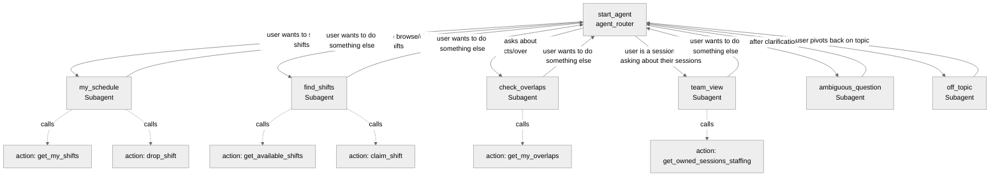

# Agent Spec: Staffing_Assistant

## Purpose & Scope

The Staffing Assistant helps event staff members manage their shift assignments conversationally. Staff can view their schedule, browse and claim available shifts, drop shifts they no longer want, identify overlapping shifts, and (for session owners) check the staffing status of their owned sessions — all through natural-language interactions inside Salesforce Lightning.

Domain: World Tour Staffing app. Targets the running user's own data (no admin actions, no impersonation).

## Behavioral Intent

- **Identity grounding.** All actions operate on the *currently logged-in user* — no `userId` parameter is exposed to the LLM. The agent never asks "which user are you?"; it relies on `UserInfo.getUserId()` inside Apex.
- **Reuse existing controllers.** All backing Apex wraps existing `@AuraEnabled` methods on `ShiftMarketplaceController` and `OverlapDashboardController`. No business logic duplication.
- **Read-mostly + two write actions.** Five read actions (schedule, available shifts, overlaps, owned sessions staffing) + two writes (claim/drop a shift). Writes require explicit user confirmation expressed via natural language ("yes claim it"); the agent surfaces the action only after the user identifies a specific shift.
- **No admin operations in scope.** Reassignment, freeze toggling, user creation, etc. are explicitly out of scope. If the user requests them, route to `off_topic`.
- **Frozen sessions are read-only.** The underlying controllers already enforce freeze semantics; the agent surfaces the resulting error message faithfully.
- **Two guardrails.** `off_topic` (anything outside staffing) and `ambiguous_question` (intent unclear). No escalation subagent — the user is already inside Salesforce, no human handoff is meaningful.
- **Variables minimal.** Conversation state is mostly carried by user utterances + action outputs; only one variable (`last_action_result`) exists to make post-action messages displayable consistently across subagents.

## Subagent Map

All transitions are **handoffs** (`@utils.transition to`). No delegation, no return-to-caller semantics. Domain subagents return to `agent_router` when the user signals a new intent.

## Variables

- `last_action_result` (mutable string = "") — Optional human-readable status message set by `claim_shift` and `drop_shift` so post-action instructions can echo "Shift claimed successfully" or the failure reason. Set by claim/drop actions; read by `find_shifts` and `my_schedule` post-action instructions.

No other state is needed. The agent reasons primarily from action outputs.

## Actions & Backing Logic

### get_my_shifts (my_schedule subagent)

- **Target:** `apex://AgentAction_GetMyShifts`
- **Backing Status:** NEEDS STUB (functional — wraps `ShiftMarketplaceController.getMyShifts()`)

#### Inputs
None.

#### Outputs

| Name | Type | Visible to User? | Source | Notes |
|------|------|-------------------|--------|-------|
| shifts | list[object] | Yes | `ShiftWrapper` | List of user's assigned shifts |
| count | integer | No | Computed | Used internally for empty-state messages |

ShiftInfo (inner class on `AgentAction_GetMyShifts`) fields:
- `shiftId` (string), `sessionName` (string), `sessionType` (string), `location` (string), `startTime` (string), `endTime` (string), `hasOverlap` (boolean)

#### Stubbing Requirement
- Apex class: `AgentAction_GetMyShifts`
- Inner class: `ShiftInfo`
- `complex_data_type_name`: `@apexClassType/c__AgentAction_GetMyShifts$ShiftInfo`
- Implementation: call `ShiftMarketplaceController.getMyShifts()`, map each `ShiftWrapper` → `ShiftInfo` (string-formatted times: HH:mm)

---

### get_available_shifts (find_shifts subagent)

- **Target:** `apex://AgentAction_GetAvailableShifts`
- **Backing Status:** NEEDS STUB (functional — wraps `ShiftMarketplaceController.getSessionsNeedingStaff()`)

#### Inputs
None.

#### Outputs

| Name | Type | Visible to User? | Source | Notes |
|------|------|-------------------|--------|-------|
| sessions | list[object] | Yes | `SessionWrapper` filtered to those with availableShifts > 0 and not frozen | Sessions with at least one open shift |

SessionInfo fields: `sessionId` (string), `sessionName` (string), `sessionType` (string), `location` (string), `availableShiftCount` (integer), `firstAvailableShiftId` (string), `firstAvailableTimeRange` (string)

#### Stubbing Requirement
- Apex class: `AgentAction_GetAvailableShifts`
- Inner class: `SessionInfo`
- `complex_data_type_name`: `@apexClassType/c__AgentAction_GetAvailableShifts$SessionInfo`
- Implementation: call `ShiftMarketplaceController.getSessionsNeedingStaff()`, filter where `!isFrozen && availableShifts > 0`, pick first unclaimed shift per session for `firstAvailableShiftId`

---

### claim_shift (find_shifts subagent)

- **Target:** `apex://AgentAction_ClaimShift`
- **Backing Status:** NEEDS STUB (functional — wraps `ShiftMarketplaceController.claimShift(shiftId)`)

#### Inputs

| Name | Type | Required | Source |
|------|------|----------|--------|
| shiftId | string | Yes | LLM extracts from prior `get_available_shifts` output or user utterance |

#### Outputs

| Name | Type | Visible to User? | Source | Notes |
|------|------|-------------------|--------|-------|
| success | boolean | Yes | Apex result | True if claim succeeded |
| message | string | Yes | Apex result | "Shift claimed successfully" or error reason |

#### Stubbing Requirement
- Apex class: `AgentAction_ClaimShift`
- Implementation: try/catch around `ShiftMarketplaceController.claimShift(shiftId)`. Catch `AuraHandledException` (frozen, already claimed) and surface its message in `Result.message` with `success=false`.

---

### drop_shift (my_schedule subagent)

- **Target:** `apex://AgentAction_DropShift`
- **Backing Status:** NEEDS STUB (functional — wraps `ShiftMarketplaceController.dropShift(shiftId)`)

#### Inputs

| Name | Type | Required | Source |
|------|------|----------|--------|
| shiftId | string | Yes | LLM extracts from prior `get_my_shifts` output |

#### Outputs

| Name | Type | Visible to User? | Source | Notes |
|------|------|-------------------|--------|-------|
| success | boolean | Yes | Apex result | True if drop succeeded |
| message | string | Yes | Apex result | "Shift dropped" or error reason |

#### Stubbing Requirement
- Apex class: `AgentAction_DropShift`
- Implementation: try/catch around `ShiftMarketplaceController.dropShift(shiftId)`. Surface `AuraHandledException` messages.

---

### get_my_overlaps (check_overlaps subagent)

- **Target:** `apex://AgentAction_GetMyOverlaps`
- **Backing Status:** NEEDS STUB (functional — wraps `OverlapDashboardController.getOverlappingShifts()`)

#### Inputs
None.

#### Outputs

| Name | Type | Visible to User? | Source | Notes |
|------|------|-------------------|--------|-------|
| overlaps | list[object] | Yes | `OverlapWrapper` filtered to current user | Conflicting shift pairs |

OverlapInfo fields: `shift1Id` (string), `shift1Session` (string), `shift1Time` (string), `shift2Id` (string), `shift2Session` (string), `shift2Time` (string)

#### Stubbing Requirement
- Apex class: `AgentAction_GetMyOverlaps`
- Inner class: `OverlapInfo`
- `complex_data_type_name`: `@apexClassType/c__AgentAction_GetMyOverlaps$OverlapInfo`
- Implementation: call `OverlapDashboardController.getOverlappingShifts()`. The controller already filters non-admins to their own overlaps via FLS. Map `OverlapWrapper` → `OverlapInfo`.

---

### get_owned_sessions_staffing (team_view subagent)

- **Target:** `apex://AgentAction_GetOwnedSessionsStaffing`
- **Backing Status:** NEEDS STUB (functional — wraps `ShiftMarketplaceController.getOwnedSessions()`)

#### Inputs
None.

#### Outputs

| Name | Type | Visible to User? | Source | Notes |
|------|------|-------------------|--------|-------|
| ownedSessions | list[object] | Yes | `SessionWrapper` of sessions where session_owner__c == current user | Per-session staffing summary |

SessionStaffingInfo fields: `sessionId` (string), `sessionName` (string), `sessionType` (string), `totalShifts` (integer), `claimedShifts` (integer), `availableShifts` (integer), `staffingStatus` (string — "Needs Staff", "Min Reached", "Fully Staffed")

#### Stubbing Requirement
- Apex class: `AgentAction_GetOwnedSessionsStaffing`
- Inner class: `SessionStaffingInfo`
- `complex_data_type_name`: `@apexClassType/c__AgentAction_GetOwnedSessionsStaffing$SessionStaffingInfo`
- Implementation: call `ShiftMarketplaceController.getOwnedSessions()`. Map `SessionWrapper` → `SessionStaffingInfo`.

## Gating Logic

No gating required — this is a hub-and-spoke employee agent with no security tiers, no sequential validation, and no admin-only paths. All actions are universally available to authenticated users; the underlying controllers enforce ownership and FLS.

The single piece of gating-like logic is the `last_action_result` variable, which conditional instructions in `find_shifts` and `my_schedule` use to display the post-action message. This is conditional instructions, not action visibility — actions are always visible.

## Architecture Pattern

**Hub-and-Spoke** with `agent_router` as the central hub. Five domain spokes (`my_schedule`, `find_shifts`, `check_overlaps`, `team_view`) plus two guardrail spokes (`off_topic`, `ambiguous_question`).

Routing strategy: the LLM in `agent_router` reads the user utterance and chooses one of six transitions based on intent keywords ("schedule"/"my shifts" → `my_schedule`; "available"/"open"/"claim" → `find_shifts`; "overlap"/"conflict" → `check_overlaps`; "my sessions"/"owned"/"managing" → `team_view`; nothing matches → `ambiguous_question` if intent unclear, `off_topic` if clearly out of scope).

After each spoke completes its work, the user usually issues a new request — the spoke's reasoning instructions tell the LLM to transition back to `agent_router` when the new request doesn't fit the current spoke's purpose.

## Agent Configuration

- **developer_name:** `Staffing_Assistant`
- **agent_label:** `Staffing Assistant`
- **agent_type:** `AgentforceEmployeeAgent` — staff members are authenticated Salesforce users acting on their own data inside the Lightning UI; this is not a customer-facing channel.
- **default_agent_user:** N/A — employee agent. MUST NOT be set (causes publish/preview to fail).
- **welcome_message:** "Hi! I can help you manage your shifts. You can ask me to show your schedule, find available shifts, claim or drop shifts, check for overlaps, or review staffing for sessions you own. What would you like to do?"
- **error_message:** "Sorry, something went wrong. Please try again or contact your admin if the problem persists."
- **personality:** Friendly and concise. Confirm actions before writes. Echo data accurately (no paraphrasing of times or session names).

## Test Utterances (for live preview validation)

| Utterance | Expected subagent | Expected action |
|---|---|---|
| "Show me my schedule" | my_schedule | get_my_shifts |
| "What shifts are available today?" | find_shifts | get_available_shifts |
| "I want to claim the Trailhead Area shift at 8:30 AM" | find_shifts | get_available_shifts → claim_shift |
| "Drop my Agentforce shift" | my_schedule | get_my_shifts → drop_shift |
| "Do I have any conflicts?" | check_overlaps | get_my_overlaps |
| "How is staffing going on the sessions I own?" | team_view | get_owned_sessions_staffing |
| "What's the weather like?" | off_topic | (none) |
| "Help" | ambiguous_question | (none) |
